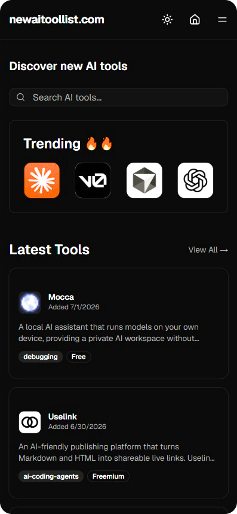
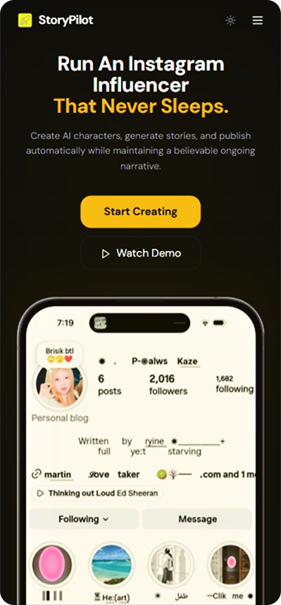
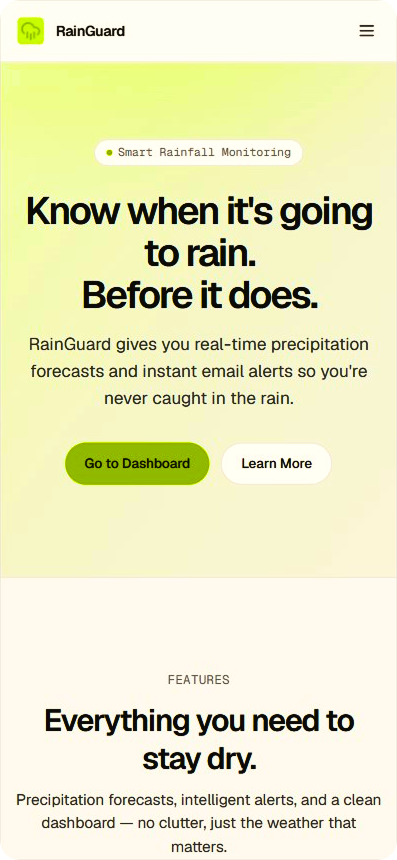

# Bicky Kumar
**`saas builder`**

💻 I use GitHub to build and experiment with dev tools, automation, and AI-related projects.

      
      
      
      
   

### 🧰 Languages and Tools

#

<h2>Latest Projects</h2>

<table>
<tr>
<td align="center">

</td>

<td align="center">

</td>

<td align="center">

</td>

<td align="center">

</td>
</tr>
</table>
